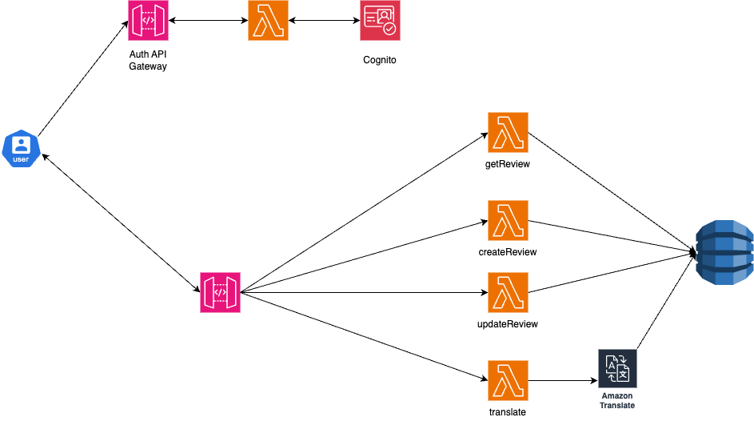

# Enterprise Web Development module - Serverless REST Assignment

Name: Zhan Luo
Demo:

## Project Overview
This project is **serverless API** that let user **create, update and view movie reviews**.  
It also **support translation** using **Amazon Translate**, so review can be read in different languages.
---

## App API Endpoints
- GET /movies/reviews/{movieId} - Retrieve all reviews for a given movie.
- POST /movies/reviews - Add a movie review (Requires Authentication).
- PUT /movies/{movieId}/reviews/{reviewId} - Update an existing review (Only the original author can modify).
- GET /reviews/{reviewId}/{movieId}/translation?language=code - Translate a review using Amazon Translate, with caching to DynamoDB.

**Auth API Endpoints**
- POST /auth/signup - User signup with email and password (Requires email verification).
- POST /auth/signin - User login, returns an ID Token, Access Token, and Refresh Token.
- POST /auth/signout - Logs out the user, invalidating the token.
---

## Features
**Translation cache**
To reduce API costs, translations are stored in DynamoDB. If a translation request is made again for the same language, the API returns the cached result instead of making a new API call to Amazon Translate.

**DynamoDB Table Structure**
- Movield (Partition Key)  - String
- ReviewId (Sort Key)    - String
- ReviewerId - String (e.g., 724534c4-5071-70f2-6d59-516355fdb82b)
- ReviewDate - String (e.g., "2025-01-20")
- Content - String (original review text)
- TargetLanguage - String
- TranslatedContent - String

**Note:** The requirement say **MovieId & ReviewId should be Number**, but we use **String** to better support API.


**Custom Constructs**
The project includes two CDK custom constructs to simplify Lambda function management:
- MovieReviewLambda Construct - Manages all Lambda functions related to reviews.
- AuthLambda Construct - Manages all Lambda functions related to authentication.


**Restricted Review Update**
- Only the original reviewer can update their review.
- The API first validates the user’s identity using Cognito.
- DynamoDB is queried to check if the user is the original author.

**API Gateway Validators**
- POST /movies/reviews
- PUT /movies/{movieId}/reviews/{reviewId}
- GET /reviews/{reviewId}/{movieId}/translation?language=code

Example:
   ```typescript
   const requestValidator = new apigateway.RequestValidator(this, "RequestValidator", {
   restApi: api,
   validateRequestBody: true,
   validateRequestParameters: true,
});

const createReviewModel = api.addModel("CreateReviewModel", {
   schema: {
      type: apigateway.JsonSchemaType.OBJECT,
      properties: {
         movieId: { type: apigateway.JsonSchemaType.STRING },
         content: { type: apigateway.JsonSchemaType.STRING },
      },
      required: ["movieId", "content"],
   },
});

reviews.addMethod("POST", new apigateway.LambdaIntegration(reviewLambda.createReviewFunc), {
   requestValidator: requestValidator,
   requestModels: { "application/json": createReviewModel },
   authorizationType: apigateway.AuthorizationType.COGNITO,
   authorizer,
});

   ```

---

## Extra
1. DynamoDB Global Secondary Index (GSI) for Translation Caching  
   To optimize translation calls, we implemented a Global Secondary Index (GSI) that allows fetching pre-translated reviews instead of calling Amazon Translate each time. This significantly reduces costs.

   **Implementation**
   - A GSI named TargetLanguageIndex is added to the MovieReviews table.
   - It allows efficient lookup of translated reviews.

   **Reference**
      - [AWS DynamoDB Global Secondary Indexes](https://docs.aws.amazon.com/amazondynamodb/latest/developerguide/GSI.html)

---
2. Custom CDK Constructs  
   we created custom construct for better organization.  
   **Benefit**
   - Improve code modularity.
   - Easier to test.  
   
   **Reference**
   - [AWS CDK Custom Constructs](https://docs.aws.amazon.com/cdk/v2/guide/constructs.html)
---
3. API Gateway Validators  
   use API Gateway Validators to reject invalid requests before they reach the backend. This reduces unnecessary Lambda execution.  

   **Implementation**
   - Request models and validation rules are set in API Gateway.
   - Invalid requests are blocked at the API layer.

   **Reference**
   - [AWS API Gateway Request Validators](https://docs.aws.amazon.com/apigateway/latest/developerguide/welcome.html)
---
4. Cognito User Authentication & Token Revocation.  
   To ensure users can sign up, sign in, and sign out securely
   **Implementation**
   - A modular Cognito setup (createCognito.ts) allows flexible configuration.
   - Logout API (signout.ts) explicitly revokes refresh tokens to increase security.

   **Reference**
   - [AWS Cognito Authentication](https://docs.aws.amazon.com/cognito/latest/developerguide/authentication.html)
   - [Cognito Token Revocation](https://docs.aws.amazon.com/cognito/latest/developerguide/logout-endpoint.html)

---

## Architecture Diagram


---

## Technology Stack
- **AWS CDK** (TypeScript) - Infrastructure as Code
- **Amazon API Gateway** - Handle API request
- **AWS Lambda** - Function execution
- **Amazon DynamoDB** - NoSQL storage for reviews
- **Amazon Cognito** - User authentication
- **Amazon Translate** - Machine translation
- **Postman** - API testing

---

## Installation
1. **Clone the repository**:
   ```bash
   git clone https://github.com/ZhanLuo2024/serverlessAPI.git
   
2. **Install dependencies**:
    ```bash
   npm install -g aws-cdk
   npm install

3. **Deployment**:
    ```bash
   cdk deploy

